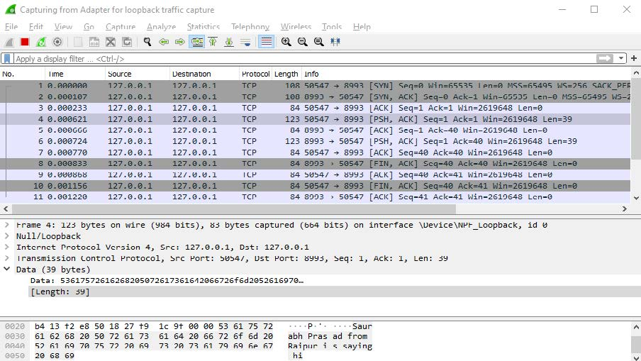

# Socket Programming using Python

Simple scripts to run a client and server sockets for TCP and UDP and transfer data through them.

TCP client and server scripts use a ```SOCK_STREAM``` while UDP client and server use ```SOCK_DGRAM``` socket type.

## Steps to run

1. Open command line or your favorite shell.
2. Run server using ```python tcpserver.py``` or ```python udpserver.py```
3. Run client using ```python tcpclient.py``` or ```python udpclient.py```

Implemented and tested on Python v3.7.4

## Results
### UDP


### TCP

